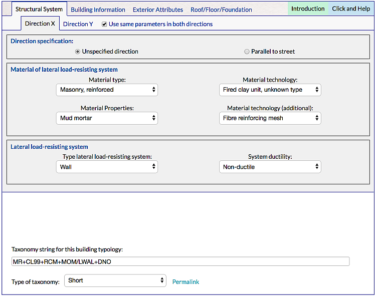
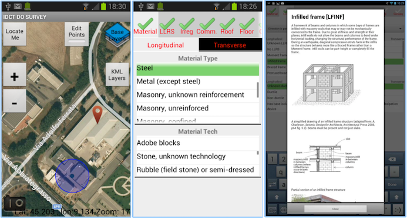

# GEM BUILDING TAXONOMY

This repository host the latest information regarding the GEM Taxonomy.

A building taxonomy (GEM Building Taxonomy) characterizes assets according to attributes that can influence the likelihood of damage due to the effects of natural hazards.  This taxonomy contained 13 building attributes, including the main material of construction, lateral load-resisting system, date of construction and number of storeys.

## Applications
- [TaxTweb](https://platform.openquake.org/taxtweb/)

- [Taxonomy Glossary](https://taxonomy.openquake.org/)

- [IDCT - Inventory Data Capture Tool](https://play.google.com/store/apps/details?id=org.globalquakemodel.org.idctdo&hl=es_CO&gl=US)

## Documentation
- GEM Taxonomy v2.0
- GED4ALL Taxonomy (GEM Taxonomy v3.0)
