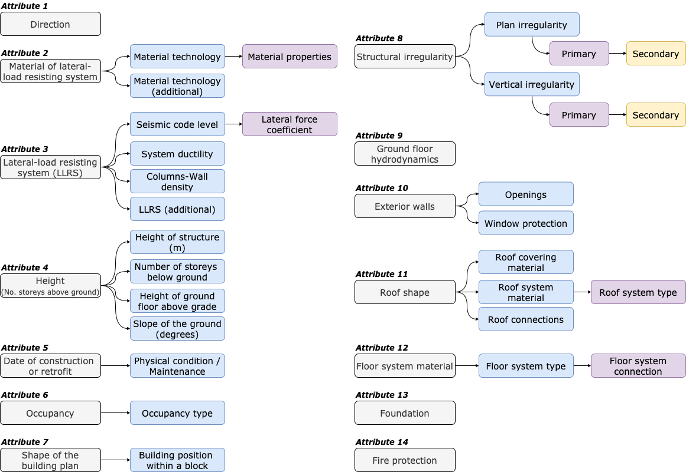
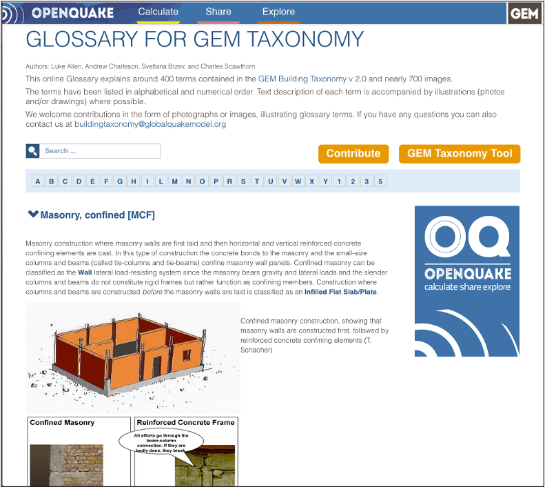

# GEM BUILDING TAXONOMY

The GEM Building Taxonomy is a uniform classification scheme, a method to describe and categorize buildings in the same way across the globe as a key step towards assessing their vulnerability and risk. The taxonomy provides a language model that characterizes assets according to attributes that can influence the likelihood of damage due to the effects of natural hazards.

The `GEM Building taxonomy v3.3` contains 13 building attributes, including the main material of construction, lateral load-resisting system, date of construction and number of storeys. This repository provides the spreadsheets with the latest attributes.

[Taxonomy_tables_v3.3.xlsx](./Taxonomy_tables_v3.3.xlsx)

## Applications

- [Taxonomy validation and explanation](https://taxonomy.openquake.org)

- [Taxonomy graph](https://taxonomy-v3.vpn.openquake.org/taxonomy/graph/)

- [Taxonomy structure](https://taxonomy-v3.vpn.openquake.org/taxonomy/attribute/)

- [Taxonomy Glossary](https://taxonomy.openquake.org/)

## Documentation

- 2022: Silva, V., Brzev, S., Scawthorn, C. et al. A Building Classification System for Multi-hazard Risk Assessment. Int J Disaster Risk Sci 13, 161–177 (2022). https://doi.org/10.1007/s13753-022-00400-x
- 2018: GED4ALL Taxonomy (GEM Taxonomy v3.0). [Global Exposure Database for Multi-Hazard Risk Analysis-Multi-hazard Exposure Taxonomy](https://www.globalquakemodel.org/gempublications/global-exposure-database-for-multi-hazard-risk-analysis-multi-hazard-exposure-taxonomy)
- 2013: [GEM Building Taxonomy v2.0](https://www.globalquakemodel.org/gempublications/gem-building-taxonomy-version-2.0)