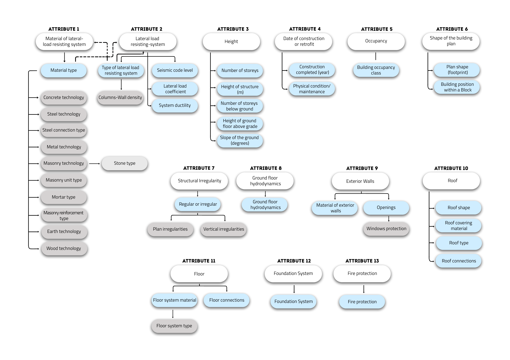
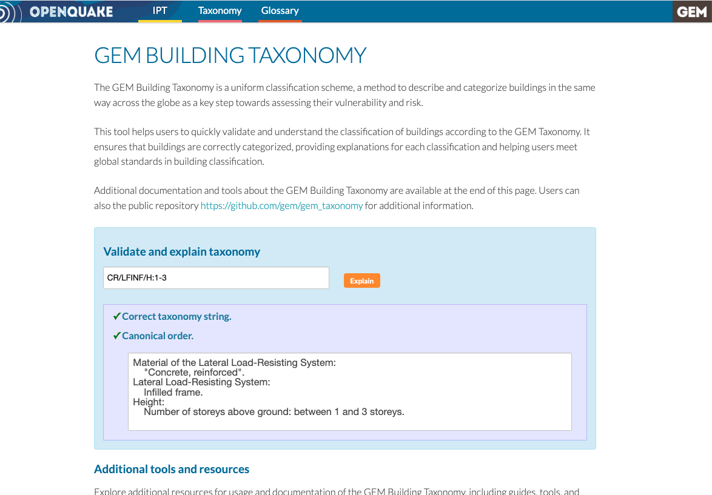
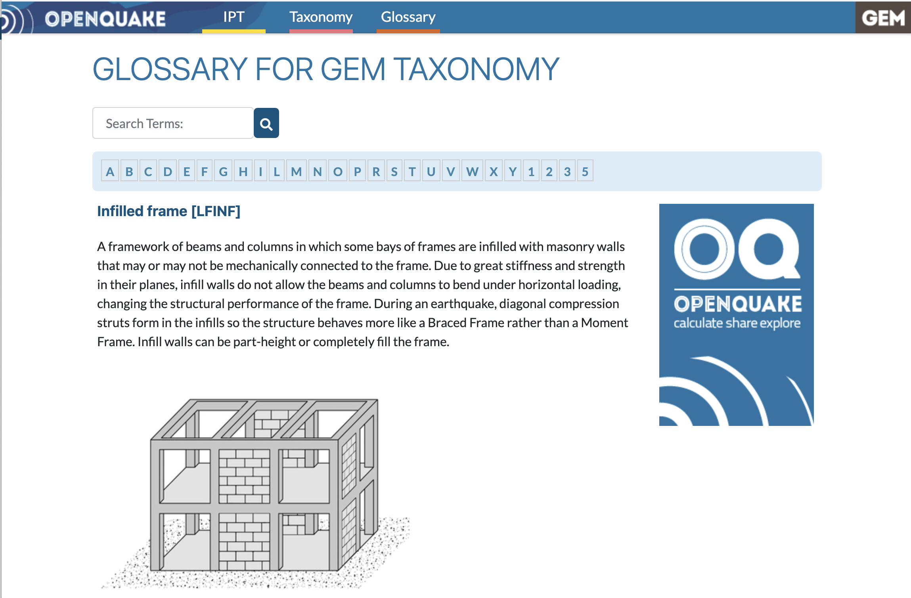

# GEM BUILDING TAXONOMY

The GEM Building Taxonomy is a uniform classification scheme, a method to describe and categorize buildings in the same way across the globe as a key step towards assessing their vulnerability and risk. The taxonomy provides a language model that characterizes assets according to attributes that can influence the likelihood of damage due to the effects of natural hazards.

The `GEM Building taxonomy v3.3` contains 13 building attributes, including the main material of construction, lateral load-resisting system, date of construction and number of storeys. This repository provides the spreadsheets with the latest attributes.

[Taxonomy_tables_v3.3.xlsx](./Taxonomy_tables_v3.3.xlsx)

## Applications

If you would like to validate a taxonomy string or gain a better understanding of its meaning, you can use the [Taxonomy validation and explanation tool](https://tools.openquake.org/taxonomy/).

For engineers and scientists working with the taxonomy for model or tool development, a Python package is available at https://github.com/gem/oq-gem-taxonomy. This package allows you to validate taxonomy strings, get a dictionary with the attributes and provides detailed explanations for each attribute within the given taxonomy.

Additional resources for exploring and working with the taxonomy include:

- [Taxonomy graph](https://tools.openquake.org/taxonomy/graph) – Visualize the relationships within the taxonomy.

- [Taxonomy structure](https://tools.openquake.org/taxonomy/structure/attribute/) – Explore the detailed structure and attributes of the taxonomy.

- [Taxonomy Glossary](https://taxonomy.openquake.org/) – A comprehensive glossary to help you understand the terminology used within the taxonomy.

## Documentation

- [2022]: A Building Classification System for Multi-hazard Risk Assessment (Silva et al. 2022). International Journal for Disaster Risk Science. https://doi.org/10.1007/s13753-022-00400-x
- [2018]: GED4ALL Taxonomy (GEM Taxonomy v3.0). [Global Exposure Database for Multi-Hazard Risk Analysis-Multi-hazard Exposure Taxonomy](https://www.globalquakemodel.org/gempublications/global-exposure-database-for-multi-hazard-risk-analysis-multi-hazard-exposure-taxonomy). Extension to GED4All Taxonomy for multi-hazard risk assessment.
- [2013]: [GEM Building Taxonomy v2.0](https://www.globalquakemodel.org/gempublications/gem-building-taxonomy-version-2.0). Initial version of the GEM Building Taxonomy for seismic risk assessment.
